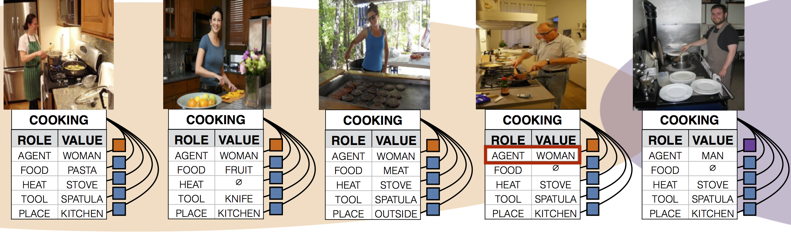

The code will be released soon.
## [Men Also Like Shopping: Reducing Gender Bias Amplification using Corpus-level Constraints](https://arxiv.org/abs/1707.09457) ##
[Jieyu Zhao](http://jyzhao.net/), [Tianlu Wang](http://www.cs.virginia.edu/~tw8cb/), [Mark Yatskar](https://homes.cs.washington.edu/~my89/), [Vicente Ordonez](http://www.cs.virginia.edu/~vicente/), [Kai-Wei Chang](http://www.cs.virginia.edu/~kc2wc/)

We improve the method about the performance in MLC tasks. The new performance should be:

<table>
    <tr>
        <th colspan="4">Performance (%)</th>
    </tr>
    <tr>
        <th colspan="2">MLC: Development Set</th>
        <th colspan="2">MLC: Test Set</th>
    </tr>
    <tr>
        <td>CRF:</td>
        <td>45.32</td>
        <td>CRF:</td>
        <td>45.53</td>
    </tr>
    <tr>
        <td>CRF+RBA</td>
        <td>45.24</td>
        <td>CRF+RBA</td>
        <td>45.43</td>
    </tr>
</table>

- ### Abstract

Language is increasingly being used to define rich visual recognition problems with supporting image collections sourced from the web. Structured prediction models are used in these tasks to take advantage of correlations between co-occurring labels and visual input but risk inadvertently encoding social biases found in web corpora. For example, in the following image, it is possible to predict  the *place* is the **kitchen**, because it is the common place for the *activity* **cooking**. However, in subfigure 4, the model predicts the agent as a woman even though it is a man, which is caused by the inappropriate correlations between the activity **cooking** and the **female** gender.

|                  |
| ---------------------------------------- |
| *Structure prediction can help the model to build the correlations between different parts. However it will also cause some bias problem.* |

In our work, we study data and models associated with multilabel object classification (MLC) and visual semantic role labeling (vSRL). We find that (a) datasets for these tasks contain significant gender bias and (b) models trained on these datasets further amplify existing bias. For example, the activity **cooking** is over 33% more likely to involve females than males in a training set, and a trained model further amplifies the disparity to 68% at test time. We propose to inject corpus-level constraints for calibrating existing structured prediction models and design an algorithm based on Lagrangian relaxation for collective inference. Our method results in almost no performance loss for the underlying recognition task but decreases the magnitude of bias amplification by 47.5% and 40.5% for multilabel classification and visual semantic role labeling, respectively.

- ### Codes

We provide our calibration function in file "fairCRF_gender_ratio.ipynb". It is based on the Lagrangian Relaxation algorithm. You need to provide your own inference algorithm and also the algorithm you used to get the accuracy performance. The function also needs you to provide your own constraints. We give detailed description about the parameters in the jupyter notebook and we also provide the running example for both vSRL and MLC tasks.

- ### Data

We have provided all the potential scores for MS-COCO dataset in data/COCO folder.  Also there is sampled potentials for imSitu dataset in data/imSitu folder. For complete imSitu potentials, download at [here](https://s3.amazonaws.com/MY89_Transfer/webly_crf_output.tar) .
